# GoBackN-Sim

A visual simulation of the Go-Back-N automatic repeat request (ARQ) protocol used in computer networking. This interactive tool demonstrates how reliable data transmission works over unreliable networks.

## How to Run the Program

You can launch the **GoBackNSim.exe** file if on **windows. Alternatively,** you can install the python dependencies, and run it via **python in the command terminal.** The easiest way to do this is by creating a virtual environment. First, make sure you have Python installed and added to your environment path. Then open command terminal in the working directory. You can do this by right clicking the directory and pressing "open in terminal", or you can run:
```bash
cd /path/to/dir/GoBackN-Sim # use backward slashes (\) if on windows. also make sure to replace /path/to/dir with your actual path to the directory (folder where this program is stored on your computer)
```
Then run:
```bash
python3 -m venv venv # make sure python is installed and added to environment path
```
Then we can activate that virtual environment. This can be done by running:
```bash
.\venv\Scripts\activate # if on windows
source venv/bin/activate # if on mac or linux
```
After activating the virtual environment, you need to install the dependencies. To do this run:
```bash
python -m pip install -r requirements.txt
# Run the line below if that didn't work
python -m pip install pyside6
```
The dependencies should now be installed. You should now be able to run the program from the command line. Make sure you're still in the **working directory,** your **venv** is turned on. _(you can activate it again if needed. No need to run python3 -m venv venv again, the venv only needs to be created once)_ Then run:
```bash
python main.py
```
## What is Go-Back-N?

Go-Back-N is a sliding window protocol used to ensure reliable data transmission between a sender and receiver over an unreliable communication channel. It's one of the fundamental protocols in computer networking that handles packet loss, corruption, and out-of-order delivery.

### How Go-Back-N Works

1. **Sliding Window**: The sender maintains a window of N packets that can be sent without waiting for acknowledgments
2. **Sequential Transmission**: Packets are sent in sequence within the window
3. **Cumulative ACKs**: The receiver sends acknowledgments for the highest in-order packet received
4. **Timeout & Retransmission**: If no ACK is received within a timeout period, the sender retransmits all unacknowledged packets
5. **Window Sliding**: When ACKs are received, the window slides forward to allow new packets to be sent

The key advantage of Go-Back-N is its simplicity - the receiver only needs to track one sequence number (the next expected packet). However, it can be inefficient when packet loss occurs, as all packets after a lost packet must be retransmitted.

## Simulation Overview

This simulator provides a visual representation of the Go-Back-N protocol in action. You can:
- Configure protocol parameters (window size, timeouts, packet loss rates)
- Watch packets travel between sender and receiver
- See how the sliding window moves as ACKs are received
- Observe retransmission behavior when packets are lost
- Manually simulate packet loss for educational purposes

## Settings Panel

The settings panel allows you to configure various aspects of the Go-Back-N protocol simulation.

### Protocol Parameters

#### Number of Packets (K)
- **Range**: 1-20 packets
- **Default**: 10 packets
- **Effect**: Sets the total number of data packets to be transmitted in the simulation
- This represents the complete message being sent from sender to receiver


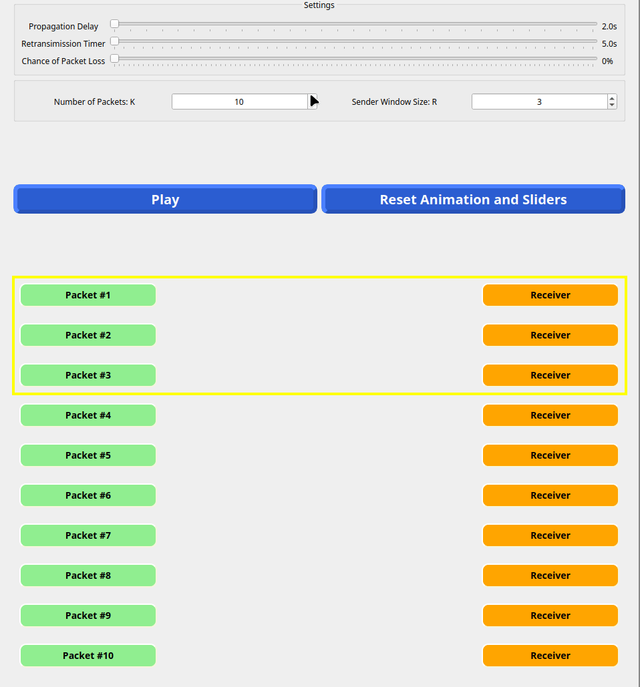

#### Sender Window Size (R)
- **Range**: 1 to K (number of packets)
- **Default**: 3 packets
- **Effect**: Determines how many packets can be "in flight" (sent but not yet acknowledged) at any time
- This is the "N" in Go-Back-N - larger windows allow more concurrent transmissions but require more buffer space

### Timing Parameters

#### Propagation Delay
- **Range**: 2.0s - 5.0s
- **Default**: 2.0s
- **Effect**: Controls the animation speed of packets traveling between sender and receiver
- Simulates the physical time it takes for signals to travel across the network medium
- Shorter delays make the simulation run faster

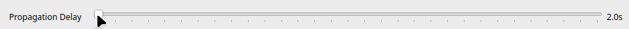

#### Retransmission Timer
- **Range**: Automatically adjusted based on propagation delay (minimum 2x + 1 second longer than propagation delay)
- **Default**: 5.0s
- **Effect**: How long the sender waits for an ACK before retransmitting packets
- Must be longer than the round-trip time (2x propagation delay) to avoid unnecessary retransmissions
- The simulator automatically ensures this constraint is met

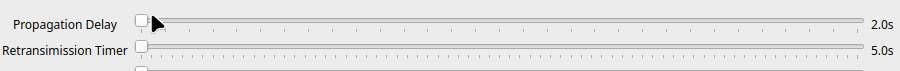

### Loss Simulation

#### Chance of Packet Loss
- **Range**: 0-100%
- **Default**: 0%
- **Effect**: Probability that any packet (data or ACK) will be randomly dropped during transmission
- Simulates real network conditions where packets can be lost due to congestion, errors, or other factors

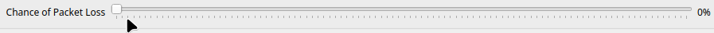  

## 75% Drop Rate Simulated
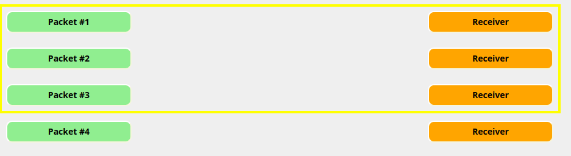  

## The Sliding Window

The yellow border around sender-receiver pairs represents the current sliding window - the packets that can be transmitted without waiting for acknowledgments.

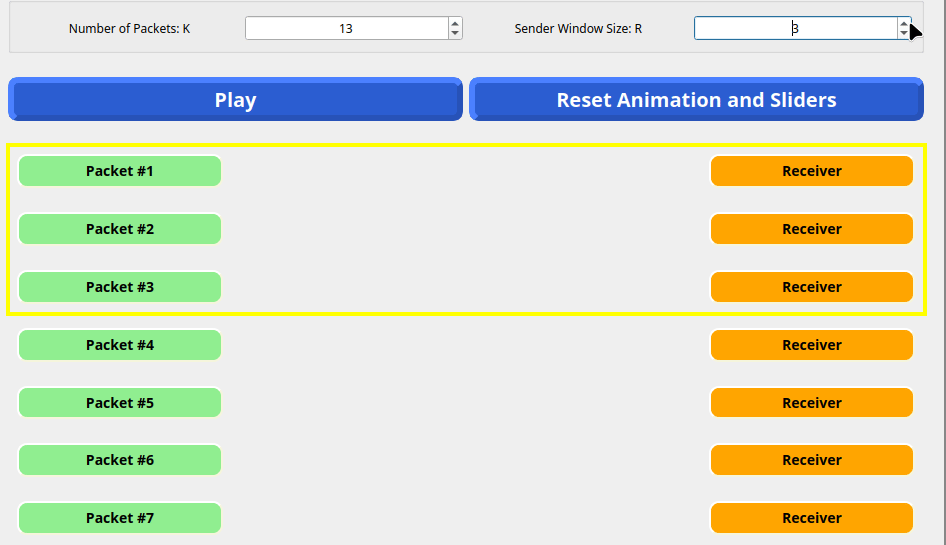

### Window Behavior
- **Initial State**: Window starts at the first N packets (where N is the window size)
- **Packet Transmission**: All packets within the window are sent simultaneously
- **Window Sliding**: When ACKs are received, the window slides forward to include new packets
- **Window Constraints**: The window never exceeds the remaining untransmitted packets

The window visualization helps you understand:
- Which packets are currently "in flight"
- How the protocol manages flow control
- Why Go-Back-N is called a "sliding window" protocol

### Window Sliding After Receiving ACKs
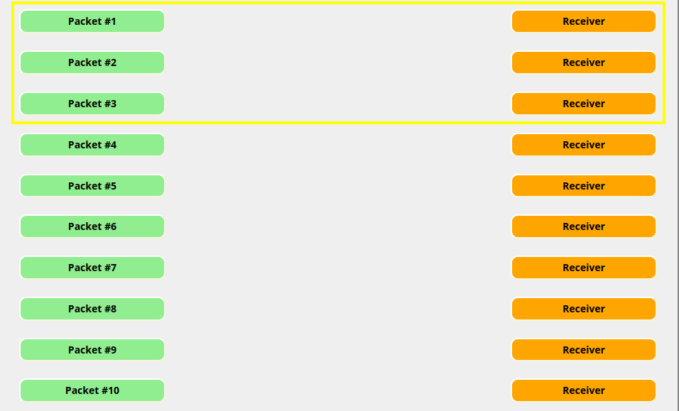


## Manual Packet Loss Control

Before starting the simulation, you can pre-configure specific packets or ACKs to be dropped for demonstration purposes.

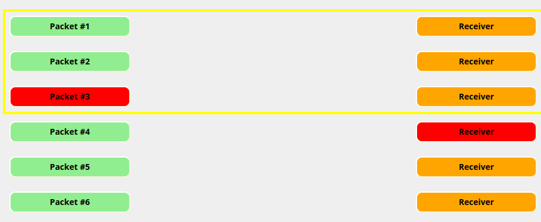

### Sender Click (Packet Loss)
- **Green State**: Packet will be transmitted normally
- **Red State**: Packet will be dropped during transmission
- Click the sender button to toggle between states
- Useful for demonstrating timeout and retransmission behavior
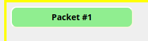
### Receiver Click (ACK Loss)
- **Orange State**: ACK will be sent normally  
- **Red State**: ACK will be dropped during transmission
- Click the receiver button to toggle between states
- Useful for showing how lost ACKs trigger retransmissions
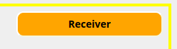

### Reset After Use
Manual loss settings automatically reset after the packet/ACK is dropped, returning to normal transmission mode.


## Interactive Packet Dropping

During the simulation, you can click on moving packets to manually drop them, simulating real-time network failures.

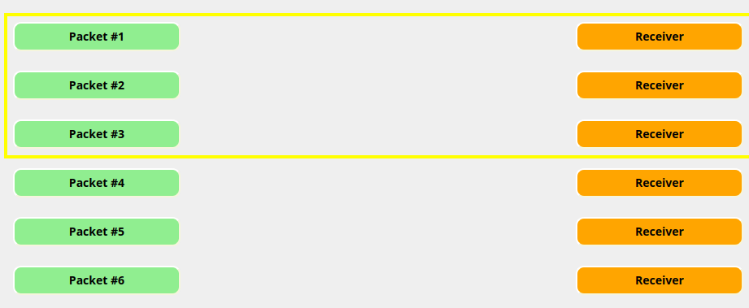

### How It Works
- Click any moving packet (data or ACK) to immediately drop it
- Dropped packets turn red and fade away
- The protocol responds as if the packet was lost in the network
- Demonstrates how Go-Back-N handles unexpected packet loss

This feature is particularly useful for:
- Testing different loss scenarios
- Understanding protocol recovery mechanisms
- Educational demonstrations of network reliability

## Visual Status Indicators

The simulation uses color coding to show the current state of each sender-receiver pair.

### Receiver States
- **Orange**: Ready to receive (initial state)
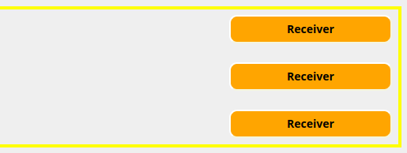
- **Light Blue**: Successfully received the next expected packet and sent ACK
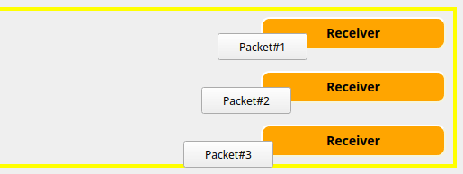
- **Red**: Configured to drop the next ACK (manual setting)
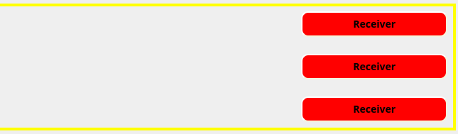
- **Blue**: Transmission completed successfully
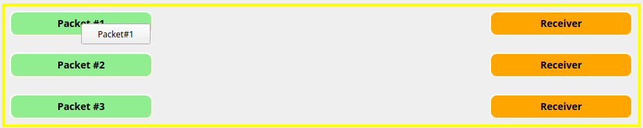
### Sender States  
- **Green**: Ready to send (initial state)
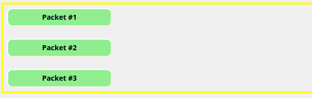
- **Red**: Configured to drop the next packet (manual setting)

- **Blue**: Transmission completed successfully (ACK received)


### Completion Indicator
When both sender and receiver turn solid blue, the "handshake" for that packet is complete - the packet was successfully delivered and acknowledged. The simulation is finished when all sender-receiver pairs are blue.

## Simulation Controls

### Play Button
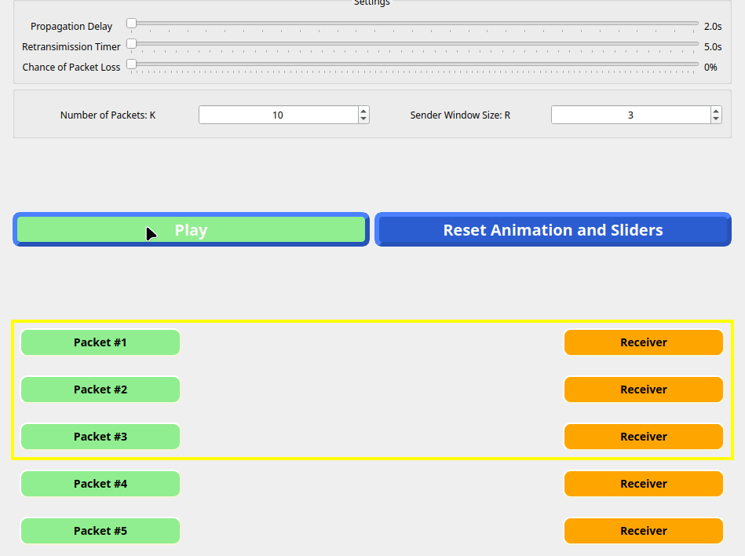

- **Function**: Starts the Go-Back-N simulation with current settings
- **Behavior**: 
  - Settings panel becomes locked (grayed out) during simulation
  - All packets within the initial window are transmitted
  - Timers and retransmission logic become active
- **Note**: Once started, the simulation runs automatically according to Go-Back-N protocol rules

### Reset Button  
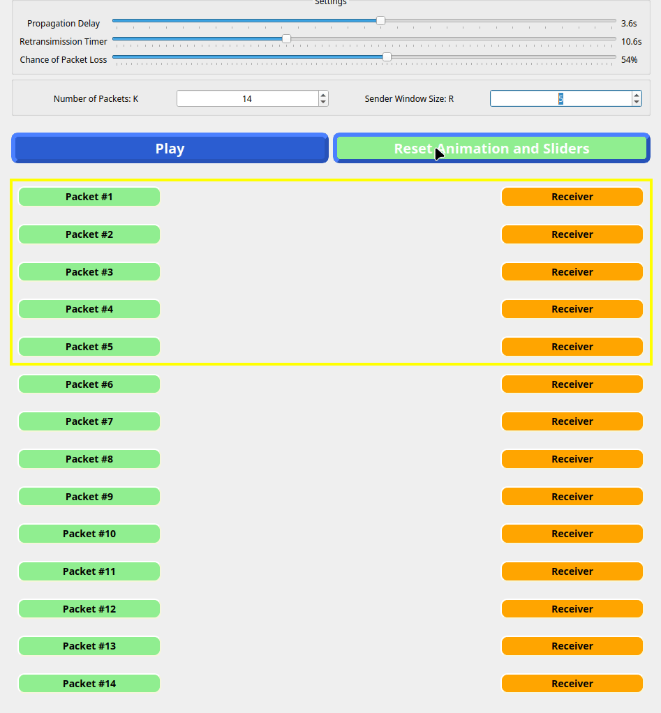

- **Function**: Stops the current simulation and resets everything to initial state
- **What Gets Reset**:
  - All sender-receiver pairs return to initial colors (green/orange)
  - Sliding window returns to starting position
  - All settings return to default values
  - Any in-flight packets are cleared
  - Settings panel becomes unlocked for modification
- **Use Cases**: 
  - Starting a new simulation with different parameters
  - Stopping a simulation that's taking too long
  - Clearing manual loss configurations

